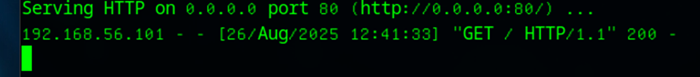

| ポートスキャン |　| |
|------|------|-----|
| TCP SYNスキャン | -sS | デフォルトのポートキャン、ルート権限が必要 |
| TCP フルコネクトスキャン | -sT | TCP　SYNスキャンより効率性が落ちる|
| UDPスキャン| -sU | UDPサービスを狙ったポートスキャン、ルート権限が必要 |
| Pingスキャン | -sP,-sn | 疎通確認する。Pingスイープに有効|
| FINスキャン | -sF | FINパケット（FINパケットだけを設定したTCPパケット）を送信するポートスキャン |
| Xmasスキャン | -sX | FIN/URG/PSHの３つのフラグを設定したTCPパケットを送信するポートスキャン |
| Nullスキャン | -sN | なんのフラグも設定しないTCPパケット |
| ACKスキャン | -sA | ACKパケットを送信するスキャン。ポートの開閉を調べるのではなく、ポートのフィルタリングの有無を調査 |

# Nmapに認識されるポートの状態
-open ⇒　サーバでサービス提供中
 
-closed ⇒　サーバーでサービス提供していない
  
# WiresharkでNmapのポートスキャン実験
1.Test（sub）でサービス用のポートを開く
```
sudo python3 -m http.server 80
```
2.Parrot(main)でコマンド実行、結果の確認
```
curl http://192.168.56.104[:]80
```

3.Test(sub)でOpenなTCPポートを調べる
```
sudo lsof -iTCP[:]80
```
- -i : オープンポートを列挙する
4.バックグラウンドでキャプチャを開始
```
sudo wireshark &
```
5.TCP SYNスキャンえを調査
- まずは空いてるポート８０を指定してスキャン
```
sudo nmap -sS -p 80 192.168.56.104
```
6.Wiresharkでパケットの観察する
- 表示フィルタに対象のアドレスを指定すると見やすくなる（定石）
7.閉じているポートに対してTCP SYNスキャン
```
sudo nmap -sS -p 21 192.168.56.104
```
8.UDPポートに対してTCP SYNスキャンする
```
sudo nmap-sS -p 67 192.168.56.100
```
9.フィルタリングされたポートに対してTCP SYNスキャンする
- ファイアウォールなどでフィルタリングされているポートにスキャン
- Testマシンで一時的に受信した全パケットを破棄するように設定してから実施
- ｜　⇒　sudo iptables -P INPUT DROP
10.実験結果
- 「ターゲット端末が起動」かつ「ポートが閉じている」ならば、拒否（RST＋ACK）パケットが帰ってくる
  - ポートが閉じている
- 「ターゲット端末がダウン」または「フィルタリングされている」なら応答は返ってこない
- 「ターゲット端末が起動」かつ「ポートが開いている」ならば、許可（SYN＋ACK）パケットが帰ってくる
  - RSTパケットを送信し、通信確立コネクションを閉じる

# TCPフルコネクトスキャンを調査
1.開いているポートに対してTCPフルコネクトスキャンする
```
sudo nmap -sT -p 80 192.168.56.104
```
- Wiresahrkの表示フィルターに
```
ip.addr == 192.168.56.104 and tcp.port == 80
```
2.閉じているポートにTCPフルコネクトスキャンする
```
sudo nmap -sT -p 21 192.168.56.104
```
3.開いているUDPポートをUDPスキャンする
| service | port |
|-----|-----|
| DNS | 53 |
| SNMP | 161,162 |
| DHCP | 67,68 |

```
sudo nmap -sU -p 67 192.168.56.100
```
